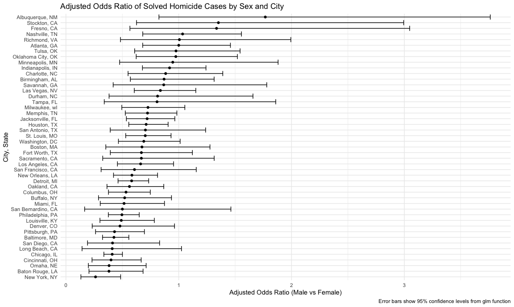
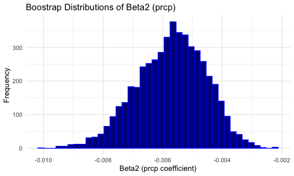
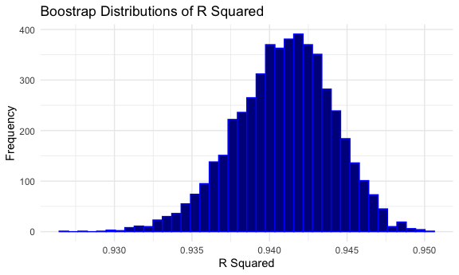
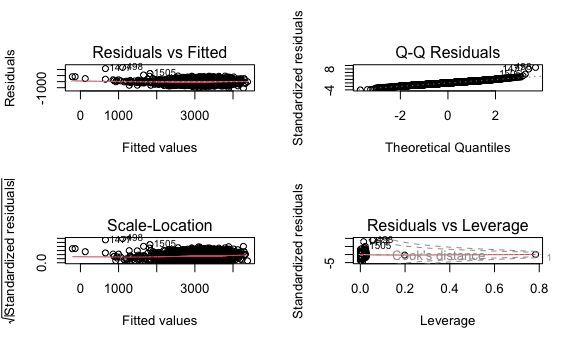
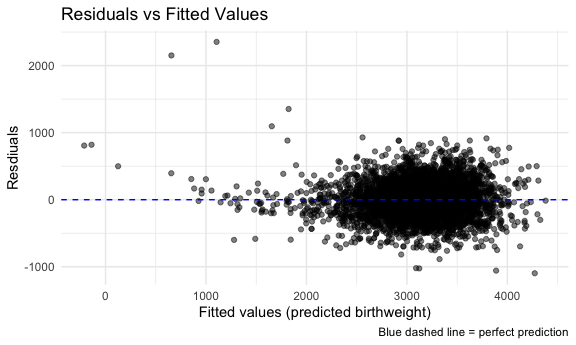
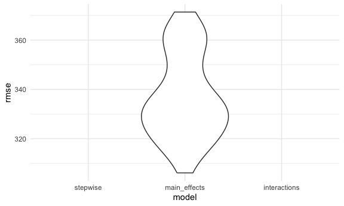

P8105 HW6
================
Maya Arnott
2025-11-29

# Problem 1: Taking a closer look at the Washington Post homicide data.

First, I’ll load and tidy the homicide data.

``` r
homicide_df = 
  read_csv("./data/homicide-data.csv") |> 
  janitor::clean_names()
```

    ## Rows: 52179 Columns: 12
    ## ── Column specification ────────────────────────────────────────────────────────
    ## Delimiter: ","
    ## chr (9): uid, victim_last, victim_first, victim_race, victim_age, victim_sex...
    ## dbl (3): reported_date, lat, lon
    ## 
    ## ℹ Use `spec()` to retrieve the full column specification for this data.
    ## ℹ Specify the column types or set `show_col_types = FALSE` to quiet this message.

Creating a `city_state` variable and binary variable for homicide
solved/unsolved.

``` r
homicide_df = homicide_df |> 
  mutate(
    # creating a city, state var
    city_state = paste(city, state, sep = ", "),
    # creating a binary case_solved var
    # 1 = case solved and 0 = case not solved/anything else
    case_solved = ifelse(grepl("^Closed by arrest", disposition), 1, 0),
    # converting age var to numeric
    victim_age = as.numeric(victim_age),
    # converting victim's sex and race to factor vars
    victim_sex = as.factor(victim_sex),
    victim_race = as.factor(victim_race)
  ) |>
  # using only data when race = white or black 
  filter (
    victim_race %in% c("White", "Black")
  ) 

homicide_df = homicide_df |> 
  dplyr::select(-city, -state) |> 
  filter(
    !city_state %in% c("Phoenix, AZ", "Kansas City, MO", "Dallas, TX", "Tulsa, AL")
  )
```

I will make a `glm` function.

``` r
baltimore_df = homicide_df |> 
  filter(city_state == "Baltimore, MD")

balt_glm = 
  glm(case_solved ~ victim_age + victim_sex + victim_race, 
      data = baltimore_df,
      family = binomial(link = "logit")
      )
summary(balt_glm)
```

    ## 
    ## Call:
    ## glm(formula = case_solved ~ victim_age + victim_sex + victim_race, 
    ##     family = binomial(link = "logit"), data = baltimore_df)
    ## 
    ## Coefficients:
    ##                   Estimate Std. Error z value Pr(>|z|)    
    ## (Intercept)       0.309981   0.171295   1.810   0.0704 .  
    ## victim_age       -0.006727   0.003324  -2.024   0.0430 *  
    ## victim_sexMale   -0.854463   0.138176  -6.184 6.26e-10 ***
    ## victim_raceWhite  0.841756   0.174716   4.818 1.45e-06 ***
    ## ---
    ## Signif. codes:  0 '***' 0.001 '**' 0.01 '*' 0.05 '.' 0.1 ' ' 1
    ## 
    ## (Dispersion parameter for binomial family taken to be 1)
    ## 
    ##     Null deviance: 3567.9  on 2752  degrees of freedom
    ## Residual deviance: 3492.7  on 2749  degrees of freedom
    ## AIC: 3500.7
    ## 
    ## Number of Fisher Scoring iterations: 4

I will tidy my glm function.

``` r
tidy_glm = 
  broom::tidy(balt_glm, conf.int = TRUE, exponentiate = TRUE)

tidy_glm |> 
  filter(term == "victim_sexMale") |> 
  dplyr::select(term, estimate, conf.low, conf.high)
```

    ## # A tibble: 1 × 4
    ##   term           estimate conf.low conf.high
    ##   <chr>             <dbl>    <dbl>     <dbl>
    ## 1 victim_sexMale    0.426    0.324     0.558

According to this logistic regression model, this means that the male
victims have 57.4% lower odds of having their homicide cases solved than
female victims when all other predictors are held constant. This odds
ratio has a confidence interval of 0.324 to 0.558. Since the confidence
interval does not include 1, this difference is statistically signi
ficant at the 0.05 level.

Now, I will run `glm` for all the cities and extract their adjusted odds
ratios.

``` r
city_results = homicide_df |> 
  group_by(city_state) |> 
  # nest data for purrr
  nest() |> 
  mutate(
    glm_model = map(data, ~ glm(
      case_solved ~ victim_age + victim_sex + victim_race,
      data = .x,
      family = binomial(link = "logit")
      )),
    tidy_glm = map(glm_model, ~tidy(.x, conf.int = TRUE, exponenitate = TRUE))
  ) |> 
  dplyr::select(city_state, tidy_glm) |> 
  # expand the results by unnesting
  unnest(tidy_glm)
```

Now, I will only extract the male vs female adjusted odds ratios and
make a table of the results.

``` r
OR_sex_by_city = city_results |> 
  filter(term == "victim_sexMale") |> 
  dplyr::select(city_state, estimate, conf.low, conf.high) |> # ensuring the column stores actual ods ratios
  mutate(
    OR = exp(estimate),
    lower_CI = exp(conf.low),
    upper_CI = exp(conf.high)
  ) |> 
  dplyr::select(-estimate, -conf.low, -conf.high)
```

Creating a plot of ORs by City, State.

``` r
# plot the data
ggplot(OR_sex_by_city, aes(
  x = OR, 
  y = fct_reorder(city_state, OR))
  ) +
  geom_point() +
  geom_errorbarh(aes(xmin = lower_CI, xmax = upper_CI)) +
  labs(
    x = "Adjusted Odds Ratio (Male vs Female)",
    y = "City, State",
    title = "Adjusted Odds Ratio of Solved Homicide Cases by Sex and City ",
    caption = "Error bars show 95% confidence levels from glm function"
  )
```



Albuquerque, NM has the greatest adjusted odds ratio of male homicide
cases solved vs female homicide cases solved, followed by Stockton,
California and Fresno, California. Male homicide victims in Albuquerque,
NM have 1.76 times the odds of having their case solved compared to
female victims, according to this model. Although, I cannot conclude
that the true odds truly differ between males and females because the
confidence interval includes 1. These three cities also happen to have
the largest confidence intervals.

The three cities with the greatest adjusted odds ratios of female
homicides solved vs male homicide cases solved is New York, NY, Baton
Rouge, LA, and Omaha, NE, respectively. In New York, NY, the odds of
solving homicides involving male victims are 74% lower than those
involving female victims, according to this model. The confidence
interval’s for these three cities do not include 1, and can be seen as
statistically significant.

# Problem 2: Bootstrapping in Central Park!

Importing the data.

``` r
library(p8105.datasets)
data("weather_df")
```

Let’s write our simple linear regression function.

``` r
weather_lm = lm(tmax ~ tmin + prcp, data = weather_df)
summary(weather_lm)
```

    ## 
    ## Call:
    ## lm(formula = tmax ~ tmin + prcp, data = weather_df)
    ## 
    ## Residuals:
    ##     Min      1Q  Median      3Q     Max 
    ## -6.5357 -2.0070 -0.3252  1.8643 22.6490 
    ## 
    ## Coefficients:
    ##               Estimate Std. Error t value Pr(>|t|)    
    ## (Intercept)  7.7756380  0.0854060  91.043   <2e-16 ***
    ## tmin         1.0174796  0.0055814 182.299   <2e-16 ***
    ## prcp        -0.0055783  0.0005927  -9.411   <2e-16 ***
    ## ---
    ## Signif. codes:  0 '***' 0.001 '**' 0.01 '*' 0.05 '.' 0.1 ' ' 1
    ## 
    ## Residual standard error: 2.73 on 2168 degrees of freedom
    ##   (19 observations deleted due to missingness)
    ## Multiple R-squared:  0.9409, Adjusted R-squared:  0.9408 
    ## F-statistic: 1.724e+04 on 2 and 2168 DF,  p-value: < 2.2e-16

Now I am going to refit the model 5,000 times, and resample the data
with replacement each time, extracting the key quantities.

``` r
boot_results = map_dfr(1:5000, function(i) {
  
  boot_sample = weather_df[sample(nrow(weather_df), replace = TRUE),]
  
  fit = lm(tmax ~ tmin + prcp, data = boot_sample)
  
  tidy_fit = tidy(fit)
  glance_fit = glance(fit)
  
  tibble(
    r2 = glance_fit$r.squared,
    beta1 = tidy_fit$estimate[tidy_fit$term == "tmin"],
    beta2 = tidy_fit$estimate[tidy_fit$term == "prcp"],
  )
})

boot_results
```

    ## # A tibble: 5,000 × 3
    ##       r2 beta1    beta2
    ##    <dbl> <dbl>    <dbl>
    ##  1 0.940  1.01 -0.00715
    ##  2 0.941  1.02 -0.00411
    ##  3 0.940  1.02 -0.00692
    ##  4 0.943  1.02 -0.00573
    ##  5 0.938  1.01 -0.00709
    ##  6 0.941  1.01 -0.00531
    ##  7 0.942  1.02 -0.00599
    ##  8 0.937  1.01 -0.00819
    ##  9 0.942  1.01 -0.00565
    ## 10 0.940  1.02 -0.00512
    ## # ℹ 4,990 more rows

I will plot the distributions of the estimates.

``` r
# plotting beta1
ggplot(boot_results, aes(x = beta1)) +
 geom_histogram(bins = 40, fill = "darkblue", color = "blue") +
  labs(
    title = "Boostrap Distributions of Beta1 (tmin)",
    x = "Beta1 (tmin coefficient)",
    y = "Frequency"
  )
```


``` r
# plotting beta2
ggplot(boot_results, aes(x = beta2)) +
 geom_histogram(bins = 40, fill = "darkblue", color = "blue") +
  labs(
    title = "Boostrap Distributions of Beta2 (prcp)",
    x = "Beta2 (prcp coefficient)",
    y = "Frequency"
  )
```



``` r
# plotting R^2
ggplot(boot_results, aes(x = r2)) +
 geom_histogram(bins = 40, fill = "darkblue", color = "blue") +
  labs(
    title = "Boostrap Distributions of R Squared",
    x = "R Squared",
    y = "Frequency"
  )
```



The distribution of Beta1 is roughly normally distributed and is
centered around 1.015, which is close to the original estimate of the
tmin coefficient in my `weather_lm` linear regression model. The
distribution of Beta2 is also roughly normally distributed and is
centered around -0.006, which is also close to my original estimate of
the prcp coefficient in my `weather_lm` linear regression model. This
suggests that the model is relatively stable. The distribution of R
Squared is more left skewed, indicating that in some bootstrap samples
the model explained less variance than the original estimate. Although,
the width of the distribution was narrow and was centered around 0.950,
indicating that the linear model explains approximately 95% of the
variance in tmax across bootstrap samples.

# Problem 3: Regression modeling for child birthweight

First, I will load and tidy the birtweight dataset.

``` r
birthweight_df = 
  read_csv("./data/birthweight.csv") |> 
  janitor::clean_names()
```

    ## Rows: 4342 Columns: 20
    ## ── Column specification ────────────────────────────────────────────────────────
    ## Delimiter: ","
    ## dbl (20): babysex, bhead, blength, bwt, delwt, fincome, frace, gaweeks, malf...
    ## 
    ## ℹ Use `spec()` to retrieve the full column specification for this data.
    ## ℹ Specify the column types or set `show_col_types = FALSE` to quiet this message.

Right now, all variables are numeric, but `babysex` `frace` `mrace` and
`malform` should be turned into factors.

``` r
birthweight_df = birthweight_df |> 
  mutate(
    babysex = factor(babysex, labels = c("Male", "Female")),
    frace   = factor(frace,
                     levels = c(1, 2, 3, 4, 8, 9),
                     labels = c("White", "Black", "Asian", "Puerto Rican",
                                "Other", "Unknown")), 
    mrace   = factor(mrace,
                     levels = c(1, 2, 3, 4, 8),
                     labels = c("White", "Black", "Asian", "Puerto Rican",
                                "Other")),
    malform = factor(malform, labels = c("absent", "present"))
  )

birthweight_df = birthweight_df |> 
  # removing variables that have colinearity
  dplyr::select(-delwt, -ppbmi, -pnumlbw, -pnumsga) |> 
  # drop unused levels/collapse small categories
  mutate(
    frace = fct_drop(frace), 
    mrace = fct_drop(mrace)
  ) 
```

I will propose a regression model for birthweight.

I am going to fit a full model first and check for multicollinearity.

``` r
full_model = lm(bwt ~ . , data = birthweight_df)
summary(full_model)
```

    ## 
    ## Call:
    ## lm(formula = bwt ~ ., data = birthweight_df)
    ## 
    ## Residuals:
    ##      Min       1Q   Median       3Q      Max 
    ## -1096.20  -184.97    -3.27   173.43  2344.13 
    ## 
    ## Coefficients:
    ##                     Estimate Std. Error t value Pr(>|t|)    
    ## (Intercept)       -6076.7233   140.3823 -43.287  < 2e-16 ***
    ## babysexFemale        28.6858     8.4640   3.389 0.000707 ***
    ## bhead               130.8081     3.4504  37.911  < 2e-16 ***
    ## blength              74.9564     2.0214  37.081  < 2e-16 ***
    ## fincome               0.2908     0.1795   1.620 0.105264    
    ## fraceBlack           14.4770    46.1426   0.314 0.753729    
    ## fraceAsian           21.1387    69.2879   0.305 0.760316    
    ## fracePuerto Rican   -47.0840    44.6725  -1.054 0.291950    
    ## fraceOther            4.6308    74.0574   0.063 0.950144    
    ## gaweeks              11.5460     1.4652   7.880 4.10e-15 ***
    ## malformpresent        9.6120    70.6165   0.136 0.891737    
    ## menarche             -3.5735     2.8937  -1.235 0.216929    
    ## mheight               6.8189     1.8006   3.787 0.000155 ***
    ## momage                0.7665     1.2218   0.627 0.530469    
    ## mraceBlack         -151.5484    46.0388  -3.292 0.001004 ** 
    ## mraceAsian          -91.9829    71.8824  -1.280 0.200744    
    ## mracePuerto Rican   -56.6028    45.1301  -1.254 0.209832    
    ## parity               95.3646    40.4705   2.356 0.018497 *  
    ## ppwt                  1.3811     0.2363   5.845 5.44e-09 ***
    ## smoken               -4.8561     0.5870  -8.273  < 2e-16 ***
    ## wtgain                4.0995     0.3948  10.385  < 2e-16 ***
    ## ---
    ## Signif. codes:  0 '***' 0.001 '**' 0.01 '*' 0.05 '.' 0.1 ' ' 1
    ## 
    ## Residual standard error: 272.4 on 4321 degrees of freedom
    ## Multiple R-squared:  0.7183, Adjusted R-squared:  0.717 
    ## F-statistic:   551 on 20 and 4321 DF,  p-value: < 2.2e-16

``` r
# double checking any variables that are perfectly collinear with other predictors
alias(lm(bwt ~ ., data = birthweight_df))
```

    ## Model :
    ## bwt ~ babysex + bhead + blength + fincome + frace + gaweeks + 
    ##     malform + menarche + mheight + momage + mrace + parity + 
    ##     ppwt + smoken + wtgain

``` r
# checking multicollinearity
vif(full_model)
```

    ##                GVIF Df GVIF^(1/(2*Df))
    ## babysex    1.046904  1        1.023183
    ## bhead      1.828625  1        1.352267
    ## blength    1.772451  1        1.331334
    ## fincome    1.271310  1        1.127524
    ## frace    477.997695  4        2.162361
    ## gaweeks    1.249335  1        1.117736
    ## malform    1.004256  1        1.002125
    ## menarche   1.069310  1        1.034075
    ## mheight    1.338101  1        1.156763
    ## momage     1.312820  1        1.145784
    ## mrace    482.584862  3        2.800672
    ## parity     1.014521  1        1.007234
    ## ppwt       1.327257  1        1.152067
    ## smoken     1.105608  1        1.051479
    ## wtgain     1.091653  1        1.044822

Now I can see the potential significant predictors for my model. When
using `vif()` to assess multicollinearity, most variables have a
GVIF^(1/(2\*Df)) value between 1 and 3 signifying mild to low
correlation. `frace` and `mrace` have the highest GVIF^(1/(2Df)) value,
but this is not critical, but is something to note when interpreting
these race coefficients in my model.

I am going to use AIC-based stepwise selection to interpret the
coefficients because the multicollinerity is not severe and this method
will work efficiently for this size and number of predictors.

``` r
step_model = stepAIC(
  full_model, 
  direction = "both", # this allows variables to both enter or leave
  trace = TRUE       # so I can clearly see the stepwise process
)
```

    ## Start:  AIC=48715.92
    ## bwt ~ babysex + bhead + blength + fincome + frace + gaweeks + 
    ##     malform + menarche + mheight + momage + mrace + parity + 
    ##     ppwt + smoken + wtgain
    ## 
    ##            Df Sum of Sq       RSS   AIC
    ## - frace     4    124995 320855679 48710
    ## - malform   1      1375 320732060 48714
    ## - momage    1     29212 320759896 48714
    ## - menarche  1    113196 320843880 48715
    ## <none>                  320730684 48716
    ## - fincome   1    194845 320925529 48717
    ## - parity    1    412149 321142833 48719
    ## - mrace     3    870885 321601569 48722
    ## - babysex   1    852579 321583264 48725
    ## - mheight   1   1064484 321795168 48728
    ## - ppwt      1   2535844 323266528 48748
    ## - gaweeks   1   4609384 325340068 48776
    ## - smoken    1   5080672 325811356 48782
    ## - wtgain    1   8005028 328735713 48821
    ## - blength   1 102060254 422790938 49914
    ## - bhead     1 106678194 427408878 49961
    ## 
    ## Step:  AIC=48709.61
    ## bwt ~ babysex + bhead + blength + fincome + gaweeks + malform + 
    ##     menarche + mheight + momage + mrace + parity + ppwt + smoken + 
    ##     wtgain
    ## 
    ##            Df Sum of Sq       RSS   AIC
    ## - malform   1      1400 320857079 48708
    ## - momage    1     28934 320884612 48708
    ## - menarche  1    117324 320973003 48709
    ## <none>                  320855679 48710
    ## - fincome   1    195814 321051493 48710
    ## - parity    1    413181 321268860 48713
    ## + frace     4    124995 320730684 48716
    ## - babysex   1    850854 321706533 48719
    ## - mheight   1   1079439 321935117 48722
    ## - ppwt      1   2541774 323397453 48742
    ## - gaweeks   1   4622677 325478356 48770
    ## - smoken    1   5040489 325896168 48775
    ## - wtgain    1   8009021 328864700 48815
    ## - mrace     3  13538606 334394285 48883
    ## - blength   1 102004740 422860419 49906
    ## - bhead     1 106809586 427665265 49955
    ## 
    ## Step:  AIC=48707.63
    ## bwt ~ babysex + bhead + blength + fincome + gaweeks + menarche + 
    ##     mheight + momage + mrace + parity + ppwt + smoken + wtgain
    ## 
    ##            Df Sum of Sq       RSS   AIC
    ## - momage    1     29211 320886290 48706
    ## - menarche  1    117635 320974714 48707
    ## <none>                  320857079 48708
    ## - fincome   1    195199 321052278 48708
    ## + malform   1      1400 320855679 48710
    ## - parity    1    412984 321270064 48711
    ## + frace     4    125020 320732060 48714
    ## - babysex   1    850020 321707099 48717
    ## - mheight   1   1078673 321935752 48720
    ## - ppwt      1   2541929 323399009 48740
    ## - gaweeks   1   4621504 325478583 48768
    ## - smoken    1   5039368 325896447 48773
    ## - wtgain    1   8024939 328882018 48813
    ## - mrace     3  13551444 334408523 48881
    ## - blength   1 102018559 422875638 49904
    ## - bhead     1 106821342 427678421 49953
    ## 
    ## Step:  AIC=48706.02
    ## bwt ~ babysex + bhead + blength + fincome + gaweeks + menarche + 
    ##     mheight + mrace + parity + ppwt + smoken + wtgain
    ## 
    ##            Df Sum of Sq       RSS   AIC
    ## - menarche  1    100121 320986412 48705
    ## <none>                  320886290 48706
    ## - fincome   1    240800 321127090 48707
    ## + momage    1     29211 320857079 48708
    ## + malform   1      1678 320884612 48708
    ## - parity    1    431433 321317724 48710
    ## + frace     4    124743 320761547 48712
    ## - babysex   1    841278 321727568 48715
    ## - mheight   1   1076739 321963029 48719
    ## - ppwt      1   2671634 323557924 48740
    ## - gaweeks   1   4676469 325562760 48767
    ## - smoken    1   5045104 325931394 48772
    ## - wtgain    1   8000672 328886962 48811
    ## - mrace     3  14667730 335554021 48894
    ## - blength   1 101990556 422876847 49902
    ## - bhead     1 106864308 427750598 49952
    ## 
    ## Step:  AIC=48705.38
    ## bwt ~ babysex + bhead + blength + fincome + gaweeks + mheight + 
    ##     mrace + parity + ppwt + smoken + wtgain
    ## 
    ##            Df Sum of Sq       RSS   AIC
    ## <none>                  320986412 48705
    ## + menarche  1    100121 320886290 48706
    ## - fincome   1    245637 321232048 48707
    ## + momage    1     11698 320974714 48707
    ## + malform   1      1884 320984528 48707
    ## - parity    1    422770 321409181 48709
    ## + frace     4    128726 320857686 48712
    ## - babysex   1    846134 321832545 48715
    ## - mheight   1   1012240 321998651 48717
    ## - ppwt      1   2824519 323810931 48741
    ## - gaweeks   1   4662501 325648912 48766
    ## - smoken    1   5073849 326060260 48771
    ## - wtgain    1   8137459 329123871 48812
    ## - mrace     3  14683609 335670021 48894
    ## - blength   1 102191779 423178191 49903
    ## - bhead     1 106779754 427766166 49950

``` r
summary(step_model)
```

    ## 
    ## Call:
    ## lm(formula = bwt ~ babysex + bhead + blength + fincome + gaweeks + 
    ##     mheight + mrace + parity + ppwt + smoken + wtgain, data = birthweight_df)
    ## 
    ## Residuals:
    ##      Min       1Q   Median       3Q      Max 
    ## -1097.18  -185.52    -3.39   174.14  2353.44 
    ## 
    ## Coefficients:
    ##                     Estimate Std. Error t value Pr(>|t|)    
    ## (Intercept)       -6098.8219   137.5463 -44.340  < 2e-16 ***
    ## babysexFemale        28.5580     8.4549   3.378 0.000737 ***
    ## bhead               130.7770     3.4466  37.944  < 2e-16 ***
    ## blength              74.9471     2.0190  37.120  < 2e-16 ***
    ## fincome               0.3180     0.1747   1.820 0.068844 .  
    ## gaweeks              11.5925     1.4621   7.929 2.79e-15 ***
    ## mheight               6.5940     1.7849   3.694 0.000223 ***
    ## mraceBlack         -138.7925     9.9071 -14.009  < 2e-16 ***
    ## mraceAsian          -74.8868    42.3146  -1.770 0.076837 .  
    ## mracePuerto Rican  -100.6781    19.3247  -5.210 1.98e-07 ***
    ## parity               96.3047    40.3362   2.388 0.017004 *  
    ## ppwt                  1.4311     0.2319   6.171 7.40e-10 ***
    ## smoken               -4.8434     0.5856  -8.271  < 2e-16 ***
    ## wtgain                4.1067     0.3921  10.475  < 2e-16 ***
    ## ---
    ## Signif. codes:  0 '***' 0.001 '**' 0.01 '*' 0.05 '.' 0.1 ' ' 1
    ## 
    ## Residual standard error: 272.3 on 4328 degrees of freedom
    ## Multiple R-squared:  0.7181, Adjusted R-squared:  0.7173 
    ## F-statistic: 848.1 on 13 and 4328 DF,  p-value: < 2.2e-16

``` r
# check multicollinearity again
vif(step_model)
```

    ##             GVIF Df GVIF^(1/(2*Df))
    ## babysex 1.045505  1        1.022499
    ## bhead   1.826019  1        1.351303
    ## blength 1.769732  1        1.330313
    ## fincome 1.205999  1        1.098180
    ## gaweeks 1.245075  1        1.115829
    ## mheight 1.315871  1        1.147114
    ## mrace   1.439897  3        1.062646
    ## parity  1.008629  1        1.004305
    ## ppwt    1.279525  1        1.131161
    ## smoken  1.101300  1        1.049428
    ## wtgain  1.077671  1        1.038110

This stepwise selected model has an R squared value of 0.7173, meaning
that 72% of the variance in birthweight can be explained by these
predictors, accounting for the number of predictors. The low F-statistic
also tells us that the model as a whole is highly significant. The
strongest effects on birthweight are baby size measurements (`bhead` and
`blength`), maternal measurements and behaviors (`wtgain` and `smoken`),
maternal race (particularly `mraceBlack` and `mracePuerto Rican`), and
gestational age (`gaweeks`).

Now, I will check the model diagnostics.

``` r
par(mfrow = c(2, 2))
plot(step_model)
```



``` r
stepwise_formula = formula(step_model)
```

I am going to plot the residuals vs fitted values using
`add_predictions()` and `add_residuals()`.

``` r
# adding predictions and residuals to df
birthweight_df2 = birthweight_df |> 
  add_predictions(step_model, var = "predicted_bwt") |> 
  add_residuals(step_model, var = "residuals")

# plotting residuals vs fitted values
ggplot(birthweight_df2, aes(x = predicted_bwt, y = residuals)) +
  geom_point(alpha = 0.5) +
  geom_hline(yintercept = 0, color = "blue", linetype = "dashed") +
  labs(
    x = "Fitted values (predicted birthweight)",
    y = "Resdiuals",
    title = "Residuals vs Fitted Values",
    caption = "Blue dashed line = perfect prediction"
  )
```



A good residual plot should have residuals that are randomly scattered
around 0 with no systematic pattern. The residuals in this plot are not
perfectly randomly scattered and the variance of residuals seems a bit
smaller for lower fitted values and larger for higher fitted values.
There are also a couple of outliers at the lower predicted birthweights.
Overall, most residuals are close to zero and captures the central trend
reasonably well, but may be violating the constant variance assumption.

Now, I will compare my model to two others.

``` r
# first model for comparison (simple main effects)
main_effects_formula = bwt ~ blength + gaweeks

# second model for comparison (with all interactions)
interactions_formula = bwt ~ (bhead + blength + babysex)^3
```

I will use `crossv_mc()` to create cross-validation splits. Then, I will
compute the prediction errors.

``` r
cv_df = 
  crossv_mc(birthweight_df, 50) |> 
  mutate(
    train = map(train, as_tibble),
    test = map(test, as_tibble)
  )

cv_rmse <- function(train, test, formula) {
  # Fit model safely
  model <- tryCatch(lm(formula, data = train), error = function(e) NULL)
  if(is.null(model)) return(NA_real_)
  
  # Align factor levels in test
  for(col in names(test)) {
    if(is.factor(train[[col]])) {
      test[[col]] <- factor(test[[col]], levels = levels(train[[col]]))
    }
  }
  
  # Predict safely
  preds <- tryCatch(predict(model, newdata = test),
                    error = function(e) rep(NA_real_, nrow(test)))
  
  valid <- !is.na(preds) & !is.na(test$bwt)
  if(sum(valid) == 0) return(NA_real_)
  
  sqrt(mean((test$bwt[valid] - preds[valid])^2))
}


# fitting the models to training data
cv_df = cv_df |> 
  mutate(
    stepwise_mod    = map(train, \(df) lm(stepwise_formula, data = df)),
    main_effects_mod = map(train, \(df) lm(bwt ~ blength + gaweeks, data = df)),
    interactions_mod = map(train, \(df) lm(bwt ~ (bhead + blength + babysex)^3, data = df))
  ) |> 
  mutate(
    # compute RMSE on test splits
    rmse_stepwise     = map2_dbl(stepwise_mod, test, \(mod, df) {
      df <- df |> mutate(across(where(is.factor), ~factor(.x, levels = levels(df))))
      sqrt(mean((df$bwt - predict(mod, newdata = df))^2))
    }),
    rmse_main_effects = map2_dbl(main_effects_mod, test, \(mod, df) {
      df <- df |> mutate(across(where(is.factor), ~factor(.x, levels = levels(df))))
      sqrt(mean((df$bwt - predict(mod, newdata = df))^2))
    }),
    rmse_interactions = map2_dbl(interactions_mod, test, \(mod, df) {
      df <- df |> mutate(across(where(is.factor), ~factor(.x, levels = levels(df))))
      sqrt(mean((df$bwt - predict(mod, newdata = df))^2))
    })
  )
```

I will summarize the results in an easy to read table.

``` r
cv_df |> 
  dplyr::select(starts_with("rmse")) |> 
  pivot_longer(
    everything(),
    names_to = "model", 
    values_to = "rmse",
    names_prefix = "rmse_") |> 
  mutate(model = fct_inorder(model)) |> 
  ggplot(aes(x = model, y = rmse)) + geom_violin()
```



I will use ridge regression cross-validation to compare the three
models.

``` r
# prepare design matrices
# Stepwise model
stepwise_formula <- bwt ~ babysex + bhead + blength + fincome + gaweeks + 
                    mheight + mrace + parity + ppwt + smoken + wtgain
x_stepwise <- model.matrix(stepwise_formula, data = birthweight_df)[,-1]

# Main effects model
main_effects_formula <- bwt ~ blength + gaweeks
x_main <- model.matrix(main_effects_formula, data = birthweight_df)[,-1]

# Interactions 3-way model
interactions_formula <- bwt ~ (bhead + blength + babysex)^3
x_inter <- model.matrix(interactions_formula, data = birthweight_df)[,-1]

# Response
y <- birthweight_df$bwt

cv_ridge_rmse <- function(x, y, nfolds = 10) {
  set.seed(123)
  cvfit <- cv.glmnet(x, y, alpha = 0, nfolds = nfolds)
  # Predict on full data using lambda.min
  preds <- predict(cvfit, newx = x, s = "lambda.min")
  sqrt(mean((y - preds)^2))
}

rmse_values <- tibble(
  model = c("stepwise", "main_effects", "interactions"),
  rmse  = c(
    cv_ridge_rmse(x_stepwise, y),
    cv_ridge_rmse(x_main, y),
    cv_ridge_rmse(x_inter, y)
  )
)

print(rmse_values)
```

    ## # A tibble: 3 × 2
    ##   model         rmse
    ##   <chr>        <dbl>
    ## 1 stepwise      272.
    ## 2 main_effects  334.
    ## 3 interactions  288.
